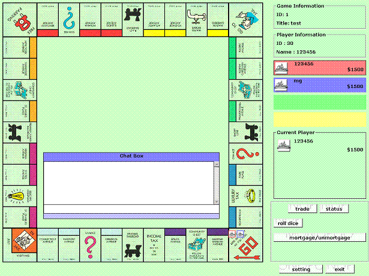

<div align="center">

## Online Monopoly


</div>

### Description

This is my final year project. Since this is a large project, I didn't do full testing on it. There is 2 projects in it which is server and client (Please run server first). The game complete with sound, music, graphic, animation, chat room, etc.. For connection, i use winsock. Enjoy the game!
 
### More Info
 
How to start the game? 1)start the SERVER. You'll see the IP ADDRESS. 2)start CLIENT, key in the server ip address you wish to connect. 3)Key in your USERNAME and PASSWORD, if you don't have, click REGISTER to create one. 4)Since you are the first player, CREATE a new game and wait for other players to join your game. Click START when everyone is ready. 5)Now start another CLIENT and login. Select the game you wish to join and click JOIN. Press READY and wait for the host to start the game. Congratulation, you can start playing the game now.


<span>             |<span>
---                |---
**Submitted On**   |2008-02-19 17:06:36
**By**             |[mungeon](https://github.com/Planet-Source-Code/PSCIndex/blob/master/ByAuthor/mungeon.md)
**Level**          |Intermediate
**User Rating**    |5.0 (15 globes from 3 users)
**Compatibility**  |VB 6\.0
**Category**       |[Games](https://github.com/Planet-Source-Code/PSCIndex/blob/master/ByCategory/games__1-38.md)
**World**          |[Visual Basic](https://github.com/Planet-Source-Code/PSCIndex/blob/master/ByWorld/visual-basic.md)
**Archive File**   |[Online\_Mom2102472192008\.zip](https://github.com/Planet-Source-Code/mungeon-online-monopoly__1-70116/archive/master.zip)

### API Declarations

```
Declare Function ShellExecute Lib "shell32.dll" Alias "ShellExecuteA" (ByVal parent As Long, ByVal operation As String, ByVal file As String, ByVal parameters As String, ByVal directory As String, ByVal mode As Long) As Long
Declare Function PlaySound Lib "winmm.dll" Alias "PlaySoundA" (ByVal lpszName As String, ByVal hModule As Long, ByVal dwFlags As Long) As Long
```


